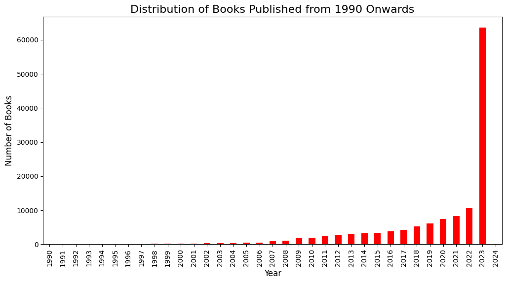
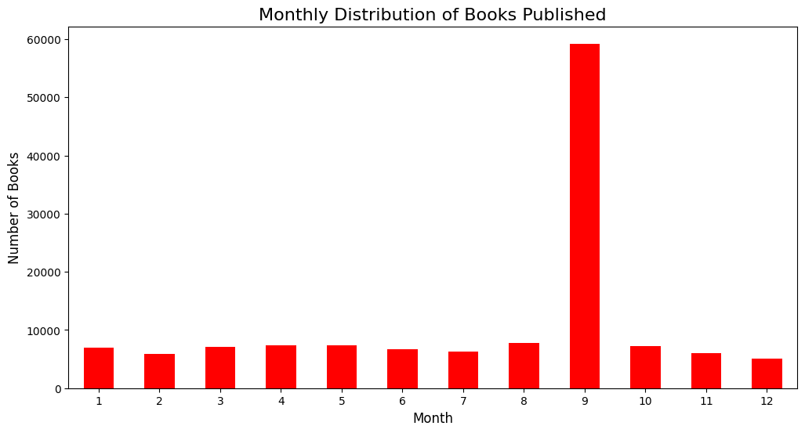
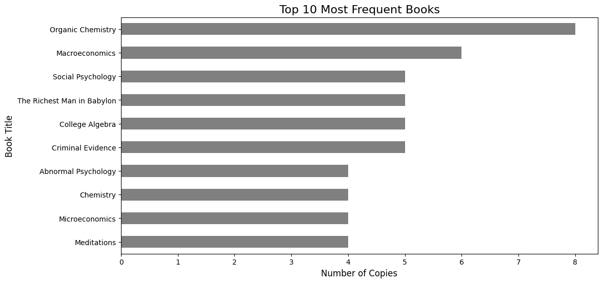
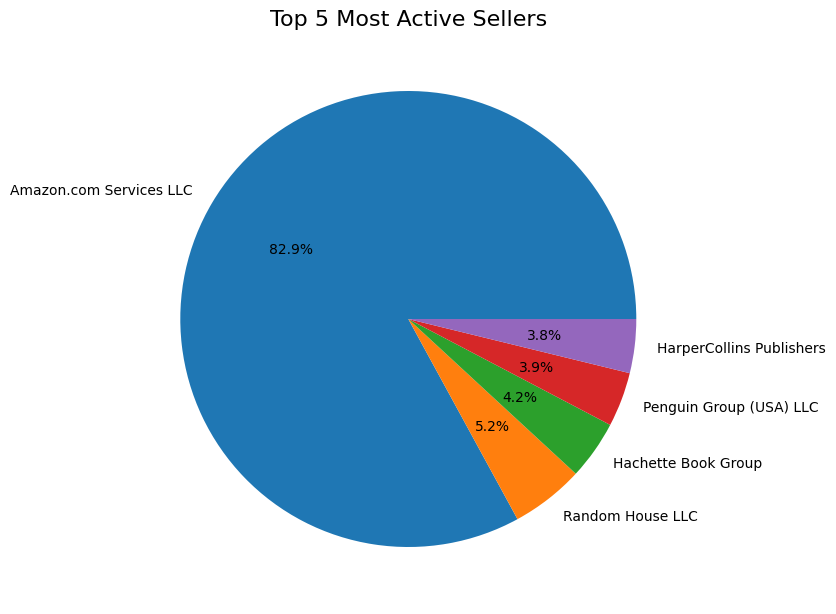

# Amazon Books Analysis 📚

## 📊 Overview
This project analyzes Amazon books data to explore pricing patterns, ratings, and author performance.

## 🛠️ Tools
- Python (Pandas, NumPy)
- Matplotlib, Seaborn
- Google Colab

## 🔍 Steps
- Data Cleaning  
- Exploratory Data Analysis (EDA)  
- Data Visualization  

## 📈 Key Insights
- Most books have high ratings (above 4.0)  
- Certain authors appear frequently among top books  
- Reviews count does not always correlate with higher ratings  
- Price varies across genres within a moderate range  

## 🚀 How to Run
- Open the notebook in Google Colab or Jupyter Notebook  
- Run all cells

- ## 📊 Results

### 📅 Books Published per Year

### 🗓️ Books Published per Month

### 📚 Top 10 Most Frequent Books

### 🛒 Top 5 Active Sellers

